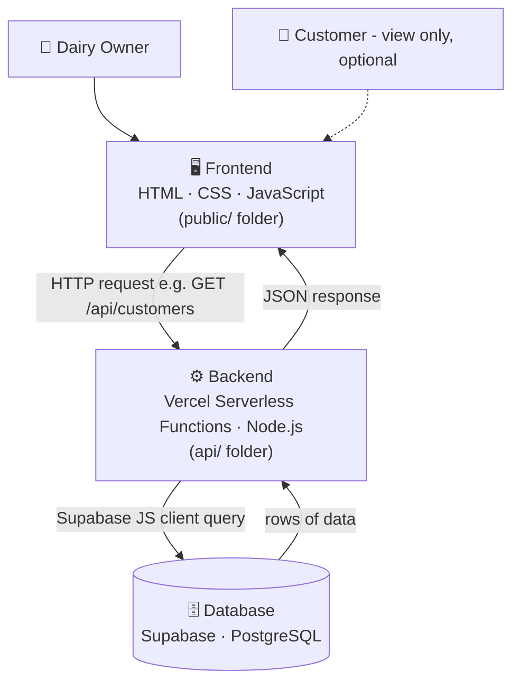
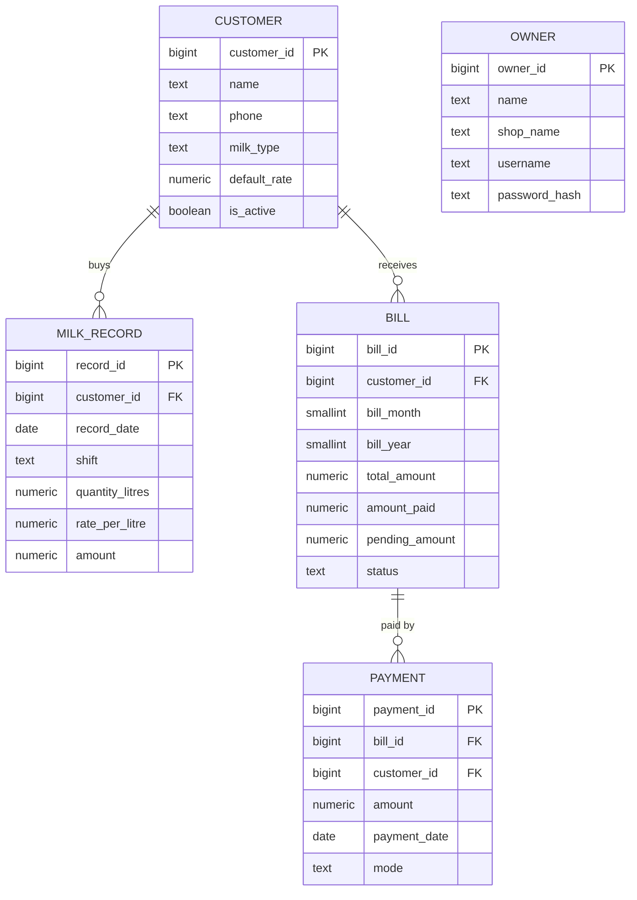

# System Architecture Description

The Digital Dairy Management System follows a three-tier architecture.

## Architecture Diagram

## Database (ER) Diagram

> The owner table only stores the shop owner's login (single-shop system), so it has no links to the other tables.
> A detailed visual version with explanations is in [dairy-architecture.html](dairy-architecture.html). Download it and open it in a browser.

## Tech Stack

| Layer | Technology |
|---|---|
| Frontend | HTML, CSS, JavaScript |
| Backend | Vercel Serverless Functions (Node.js) |
| Database | Supabase (PostgreSQL) |
| Database access | `@supabase/supabase-js` |

## 1. Frontend Layer
The frontend is responsible for user interaction.

Functions:
- Owner dashboard
- Customer management forms
- Daily milk entry page
- Billing and payment views
It collects user input and sends requests to the backend.

## 2. Backend Layer
The backend handles the main business logic.

Responsibilities:
- Process user requests
- Validate entered data
- Calculate milk amount
- Generate monthly bills
- Manage authentication

## 3. Database Layer
The database stores all system information.

Main tables:

### Owner
Stores dairy owner details.

### Customer
Stores customer information.

### Milk_Record
Stores daily milk purchase details.

### Bill
Stores monthly generated bills.

### Payment
Stores payment transactions.

## Data Flow
Dairy Owner → Frontend → Backend → Database
The owner enters daily milk details through the frontend. The backend processes the request and stores the information securely in the database.
