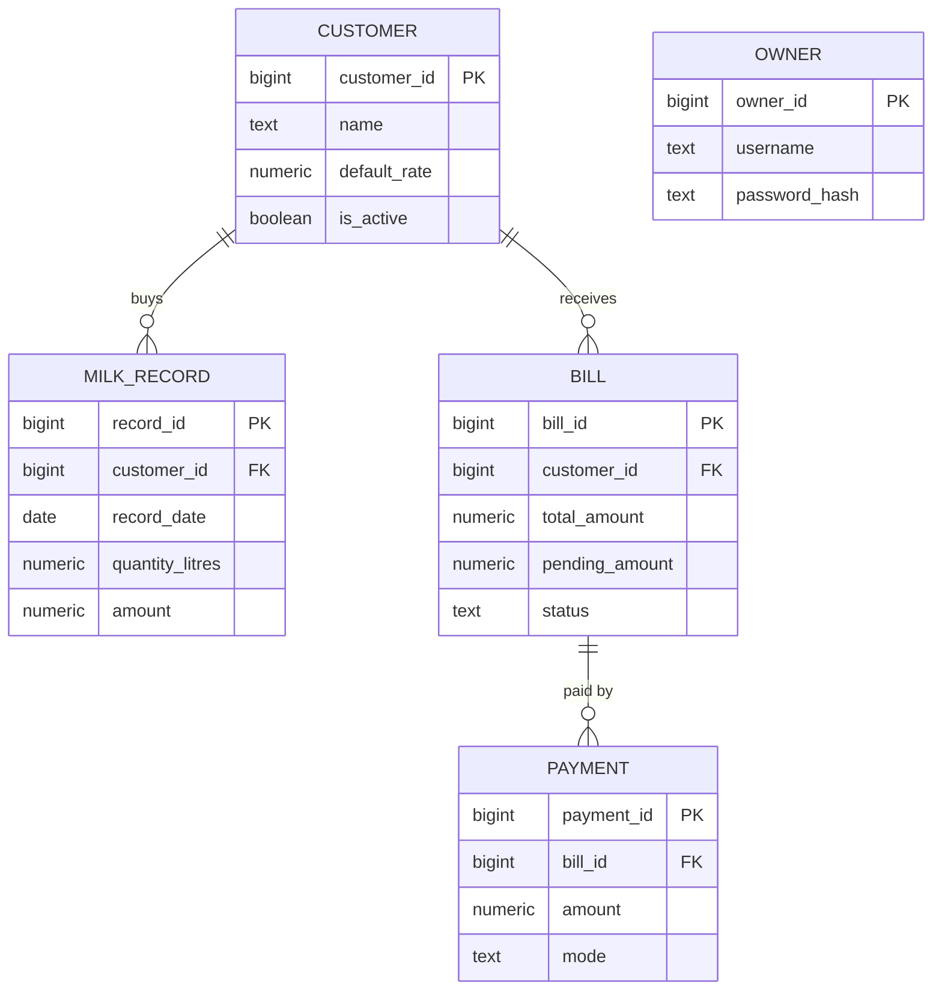

# Supabase Database

The database for the Digital Dairy Management System, built on **Supabase (PostgreSQL)**.
It is a single-shop system: one dairy, one owner, many customers.

## Files

| File | What it does |
|---|---|
| [dairy_schema.sql](dairy_schema.sql) | Creates the 5 tables and inserts sample data |
| [supabase_rls.sql](supabase_rls.sql) | Turns on Row Level Security and lets the API read customers |
| [database_design.md](database_design.md) | Explains every table and column |

## Tables



| Table | Purpose | Sample rows |
|---|---|---|
| `owner` | Login for the shop owner | 1 |
| `customer` | People who buy milk | 5 |
| `milk_record` | One row per delivery (date + shift) | 5 |
| `bill` | One monthly bill per customer | 5 |
| `payment` | Money received against a bill | 5 |

## Design highlights

- **The database does the maths.** `milk_record.amount = quantity × rate` and `bill.pending_amount = total − paid` are generated columns, so they can never be calculated wrongly.
- **The rate is saved on every milk record**, so old bills stay correct when the price changes.
- **Rules block bad data:** quantities must be positive, shift must be morning or evening, and there's only one bill per customer per month.
- **Money uses `numeric(10,2)`**, so there are no rounding errors.

## How to set it up

1. Create a free project at [supabase.com](https://supabase.com).
2. Open **SQL Editor**, then run [dairy_schema.sql](dairy_schema.sql).
3. Run [supabase_rls.sql](supabase_rls.sql).
4. Check the data by running:
   ```sql
   select sum(pending_amount) from bill where status <> 'Paid';  -- expected 9640.00
   ```
